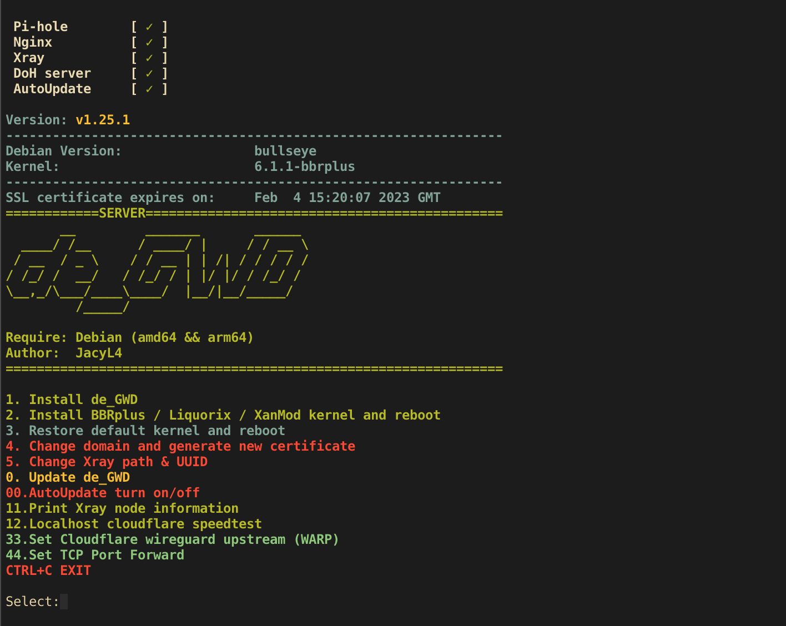
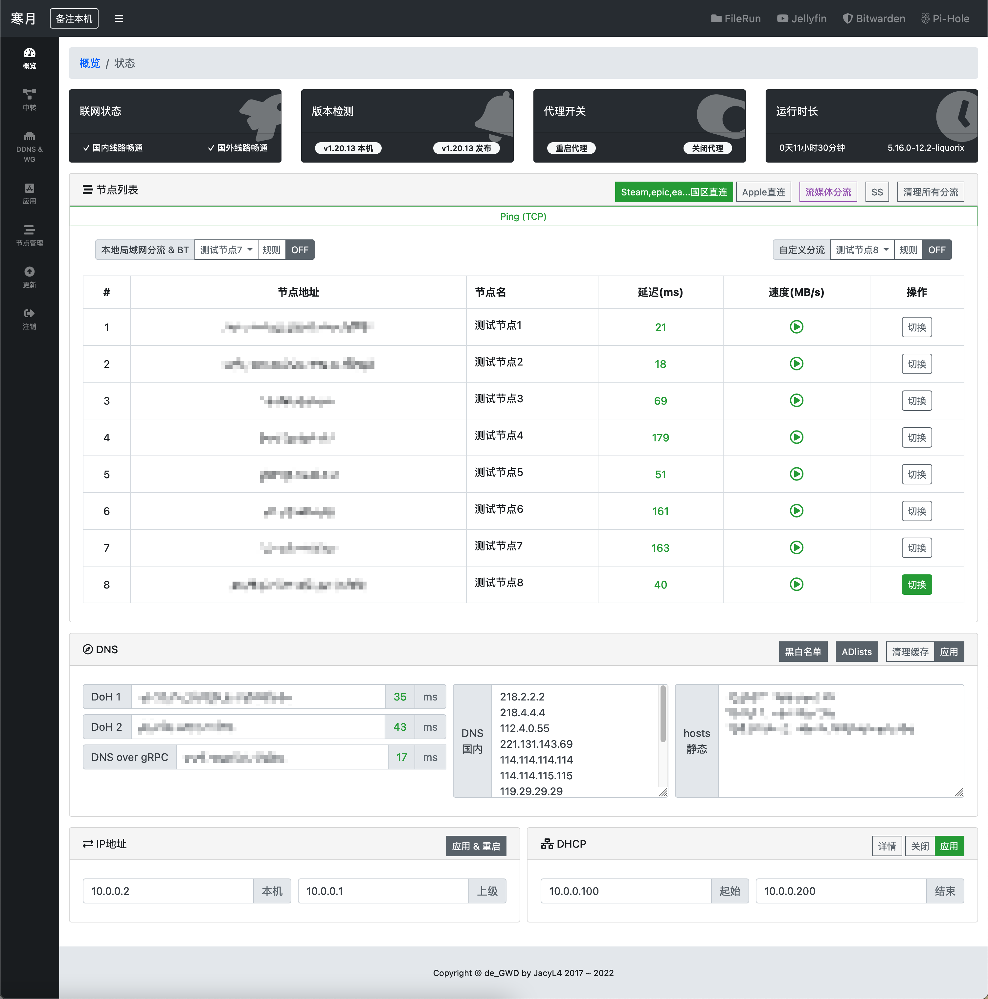
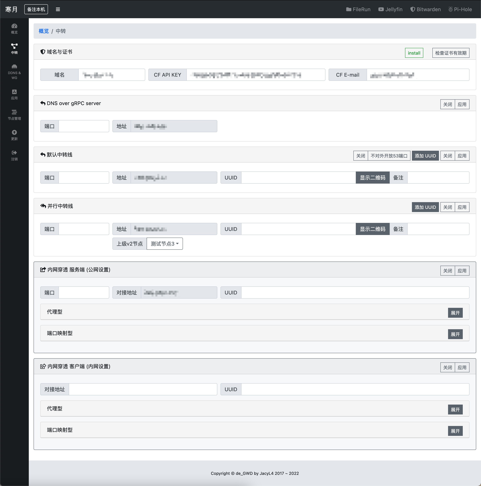
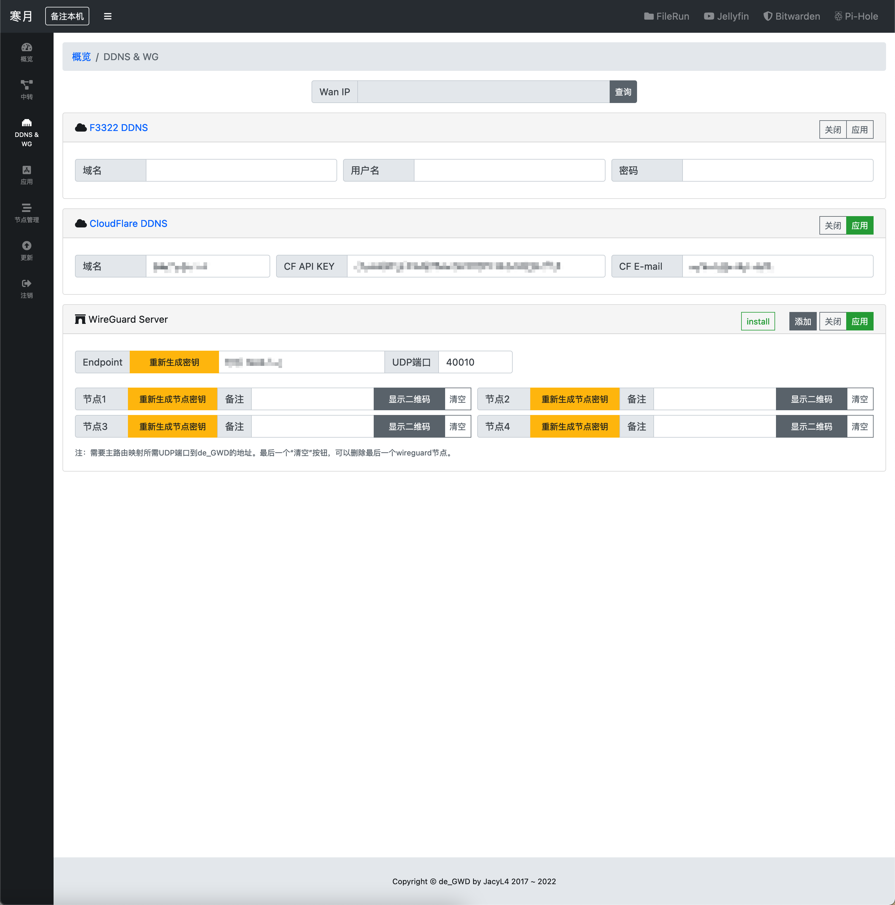
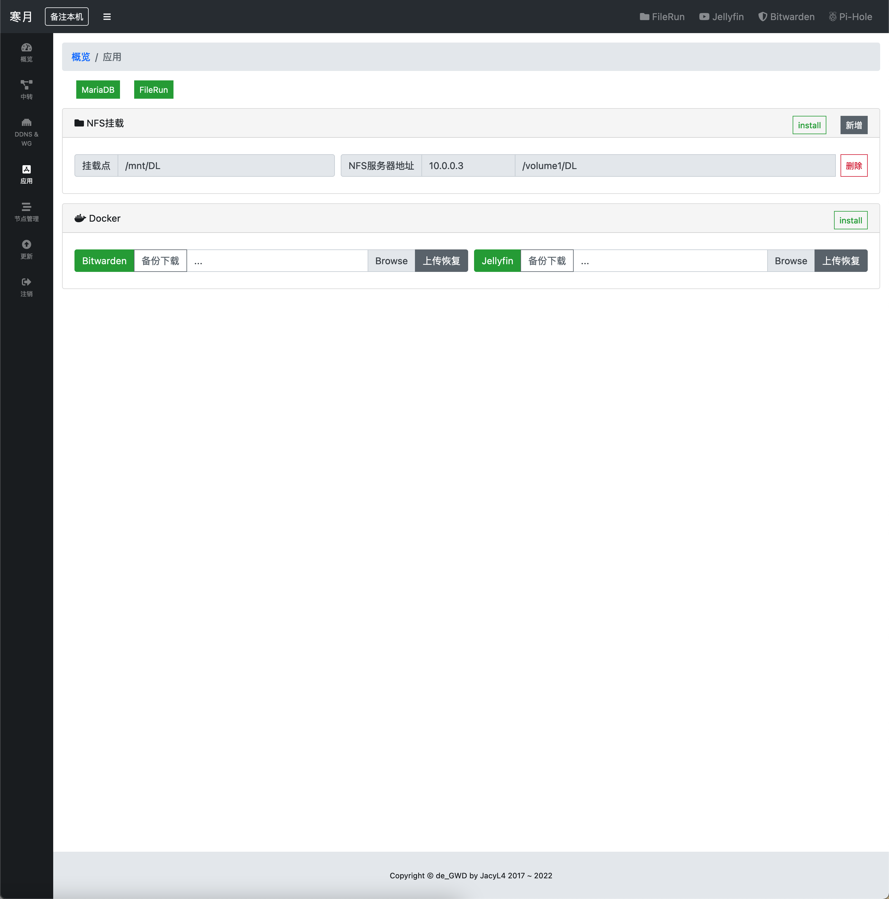
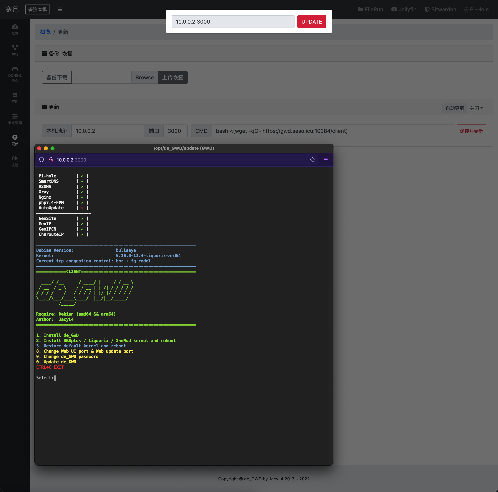

# dex

独立维护的 Debian 旁路网关（基于寒月 / de_GWD 的修改版）。

* 具备流量整形加速的旁路网关
* 仅供学习与研究，不支持机场的双端自建方案
* 基于性能考量，尽量避免使用虚拟交换

本仓库协议为 [EPL-2.0](LICENSE.md)。来源与署名见 [NOTICE.md](NOTICE.md)。

安装、更新和 Release 只使用本仓库：https://github.com/stuinx/dex

## Server (amd64 & arm64) support kvm xen openvz lxc and so on:

```
bash <(wget --no-check-certificate -qO- https://raw.githubusercontent.com/stuinx/dex/dev/server)
```



## Client (amd64):

```
bash <(wget --no-check-certificate -qO- https://gh.stuinx.eu.org/https://raw.githubusercontent.com/stuinx/dex/dev/client)
```

国内安装默认经 `gh.stuinx.eu.org` 拉 GitHub 资源，失败会换 `gh-proxy.com` / `ghproxy.net` / `ghfast.top`。Pi-hole 镜像优先 `docker.1ms.run` / `docker.1panel.live`，不先打 Docker Hub。可覆盖：`GH_PROXY=https://gh.stuinx.eu.org/`。

或

手动上传 client 文件与 de_GWD 压缩包后

```
chmod +x client
./client
```







## Manual

仓库文档：https://github.com/stuinx/dex

Release：https://github.com/stuinx/dex/releases

Server 菜单 **55 Extra inbounds**（主 VMess 不变）：VLESS+REALITY、VLESS+WS+TLS（可同域名、端口必须不同，nginx 单独写 `vless-ws.conf`，UUID/path 按主 VMess 生成）、SOCKS5、dokodemo 多规则。操作流程：[docs/server-menu-55.md](docs/server-menu-55.md)。进入 `bash /opt/de_GWD/server` → 55，`[0]` 查看已添加项。

## Thanks to

* [ XTLS/Xray-core ](https://github.com/XTLS/Xray-core)
* [ coredns/coredns ](https://github.com/coredns/coredns)
* [ pymumu/smartdns ](https://github.com/pymumu/smartdns)
* [ IrineSistiana/mosdns ](https://github.com/IrineSistiana/mosdns)
* [ m13253/dns-over-https ](https://github.com/m13253/dns-over-https)
* [ pi-hole/docker-pi-hole ](https://github.com/pi-hole/docker-pi-hole)
* [ mmotti/pihole-regex ](https://github.com/mmotti/pihole-regex)
* [ Loyalsoldier/v2ray-rules-dat ](https://github.com/Loyalsoldier/v2ray-rules-dat)
* [ makotom/cfspeed ](https://github.com/makotom/cfspeed)
* [ mzz2017/lkl-haproxy ](https://github.com/mzz2017/lkl-haproxy)
* [ zabbly/linux ](https://github.com/zabbly/linux)
* [ xanmod/linux ](https://github.com/xanmod/linux)
* [ tsl0922/ttyd ](https://github.com/tsl0922/ttyd)
* [ mikefarah/yq ](https://github.com/mikefarah/yq)
* [ nyanmisaka/jellyfin ](https://hub.docker.com/r/nyanmisaka/jellyfin)
* [ dani-garcia/vaultwarden ](https://github.com/dani-garcia/vaultwarden)
